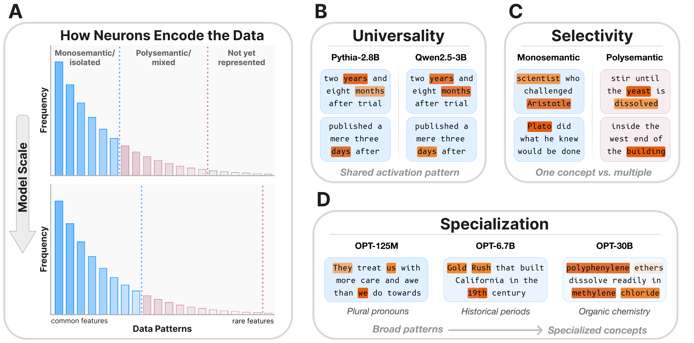

# **Neuron Populations Exhibit Divergent Selectivity with Scale**

[[Paper](http://arxiv.org/abs/2606.03990)] [[Project Page](https://avdravid.github.io/rosetta-neuron-scaling/)]

Amil Dravid<sup>1</sup>, Yasaman Bahri<sup>1</sup>, Alexei A. Efros<sup>1</sup>, Yossi Gandelsman<sup>2</sup><br>
<sup>1</sup>UC Berkeley &nbsp;&nbsp; <sup>2</sup>TTIC

Official code release for **"Neuron Populations Exhibit Divergent Selectivity with Scale"**

<p align="center">
  
</p>

> We investigate whether neuron populations within neural networks evolve predictably with scale, extending scaling laws beyond macroscopic observables such as loss. To probe this question, we study <em>[Rosetta Neurons](https://arxiv.org/abs/2306.09346)</em>, a previously characterized class of neurons whose activation patterns are similar across independently trained models. In separate analyses of language models up to 30B parameters and vision models up to 5B parameters, we observe that the population of Rosetta Neurons follows a sublinear power law in model size, growing in absolute number but occupying a shrinking fraction of the total neuron count. We further observe a <em>Neuron Polarization Effect</em>: Rosetta Neurons become more selective and increasingly monosemantic with scale, separating from a growing non-Rosetta population that remains less selective. An analytical model balancing feature utility against limited neuron capacity explains the sublinear power-law scaling and this polarization effect. Finally, we find that Rosetta Neurons become more domain-specialized with scale and illustrate their selectivity through a targeted data-filtering case study for continued pretraining. Our results point to a scaling law for interpretable, shared neuron-level structure, linking model size to systematic changes in neuron universality, selectivity, and specialization.

---

Rosetta Neurons are individual neurons that fire on the same inputs across independently-trained models. This repo contains the pipelines for discovering and visualizing them across scale in two modalities:

- **[`language/`](language/)** — find Rosetta neurons across language models (Pythia, GPT-2, OPT, Qwen, …). Aligns activations across mismatched tokenizers via UTF-8 byte spans; computes mutual top-K best-buddy pairs of MLP units; intersects across multiple models to produce "Rosetta anchors".
- **[`vision/`](vision/)** — find Rosetta neurons across vision models (DINOv2/v3, OpenCLIP, diffusion, …). Aligns activations on a canonical spatial patch grid; produces best-buddies and Rosetta anchors over generative ↔ discriminative model pairs.
- **[`common/`](common/)** — common functions used by both pipelines.

## Release checklist

- [x] Release Language Matching Code
- [x] Release Vision Matching Code
- [x] Release Visualization Code
- [ ] Release Precomputed Rosetta Neurons

## Install

```bash
pip install -r requirements.txt
```

The top-level `requirements.txt` covers both pipelines. If you only need one modality, the per-modality `language/requirements.txt` and `vision/requirements.txt` are leaner. The vision pipeline additionally depends on several external model repos — see [`vision/third_party.md`](vision/third_party.md).

## Quickstart

```bash
# Language: pairwise Rosetta match between two LMs (auto-uses Pile val at ./pile/)
cd language && NPROC_PER_NODE=8 bash match.sh EleutherAI/pythia-1b unsloth/Llama-3.2-1B
# → open ./outputs_cross/index.html

# Language: multi-model Rosetta anchors (first model is the anchor)
cd language && NPROC_PER_NODE=8 bash match.sh \
  EleutherAI/pythia-6.9b facebook/opt-6.7b Qwen/Qwen2.5-7B
# → open ./outputs_anchor/index.html

# Vision: pairwise match between a generative model (pMF) and a discriminative ViT (OpenCLIP)
cd vision && bash scripts/example_match.sh
```

See each subdir's README for the full pipeline (matching → best-buddies → Rosetta anchors → visualization), CLI flags, and environment-variable knobs. Both pipelines produce a single self-contained `index.html` you can open in any browser.

## Repo layout

```
rosetta-neurons/
├── common/      # shared correlation + mutual-top-K helpers
├── language/    # LM pipeline (Pythia/OPT/Qwen/Llama, byte-aligned spans)
├── vision/      # vision pipeline (pMF/Flux/Sana/DINO/CLIP/…)
└── requirements.txt
```

## Citation

If you found this repository useful please consider starring ⭐ and citing:

```bibtex
@article{dravid2026neuron,
  title  = {Neuron Populations Exhibit Divergent Selectivity with Scale},
  author = {Dravid, Amil and Bahri, Yasaman and Efros, Alexei A. and Gandelsman, Yossi},
  year   = {2026},
  note   = {arXiv:TODO}
}
```

